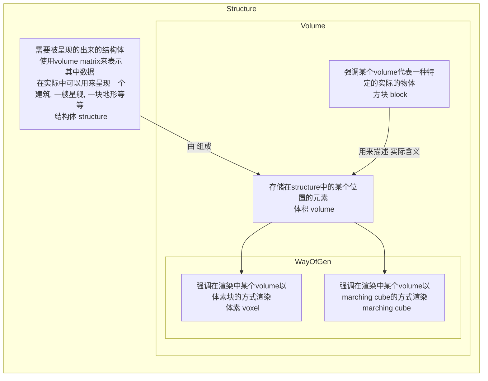

```mermaid
graph TB
    subgraph Structure
        direction TB
        structure[需要被呈现的出来的结构体<br> 使用volume matrix来表示其中数据<BR> 在实际中可以用来呈现一个建筑, 一艘星舰, 一块地形等等<br> 结构体 structure]
        structure-->|由 组成|volume
        subgraph Volume
            direction TB
            volume[存储在structure中的某个位置的元素<br> 体积 volume]
            block[强调某个volume代表一种特定的实际的物体<br> 方块 block]
            block-->|用来描述 实际含义|volume
            volume-->voxel
            volume-->marching-cube
            subgraph WayOfGen
                direction TB
                voxel[强调在渲染中某个volume以体素块的方式渲染<br> 体素 voxel]
                marching-cube[强调在渲染中某个volume以marching cube的方式渲染<br>  marching cube]
            end
        end
    end
```

