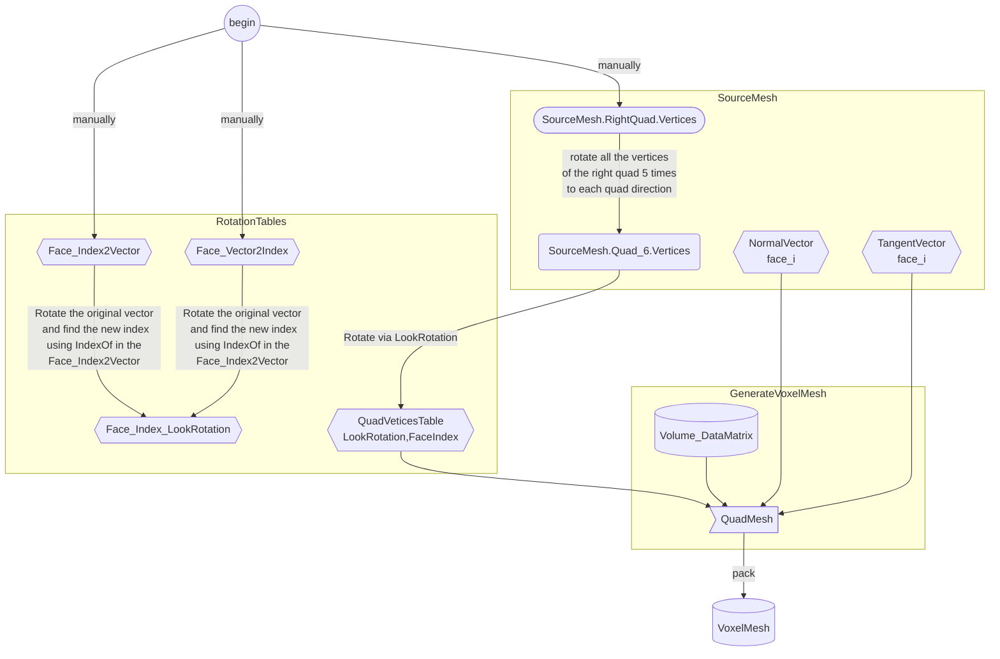

```mermaid
graph TB

      _((begin))
      _-->|manually|face-i-2-vector
      _-->|manually|face-vector-2-i
      _-->|manually|r-quad-v

      subgraph RotationTables
      face-i-2-vector{{Face_Index2Vector}}
      face-vector-2-i{{Face_Vector2Index}}
      face-i-2-vector & face-vector-2-i-->|Rotate the original vector<br> and find the new index<br> using IndexOf in the Face_Index2Vector|face-i-lookrotation
      face-i-lookrotation{{Face_Index_LookRotation}}
      quad-v-lookrotaion-face-i{{QuadVeticesTable<br>LookRotation,FaceIndex}}
      end

      subgraph SourceMesh
      r-quad-v([SourceMesh.RightQuad.Vertices])
      source-6-quad-v(SourceMesh.Quad_6.Vertices)
      r-quad-v-->|rotate all the vertices<br> of the right quad 5 times<br> to each quad direction|source-6-quad-v
      normal-face-i{{NormalVector<br>face_i}}
      tangent-face-i{{TangentVector<br>face_i}}
      end

      source-6-quad-v-->|Rotate via LookRotation|quad-v-lookrotaion-face-i

      subgraph GenerateVoxelMesh
      volume-matrix[(Volume_DataMatrix)]
      each-quad-mesh>QuadMesh]
      end

      quad-v-lookrotaion-face-i-->each-quad-mesh
      volume-matrix-->each-quad-mesh
      normal-face-i-->each-quad-mesh
      tangent-face-i-->each-quad-mesh
      each-quad-mesh-->|pack|voxel-mesh

      voxel-mesh[(VoxelMesh)]


```
